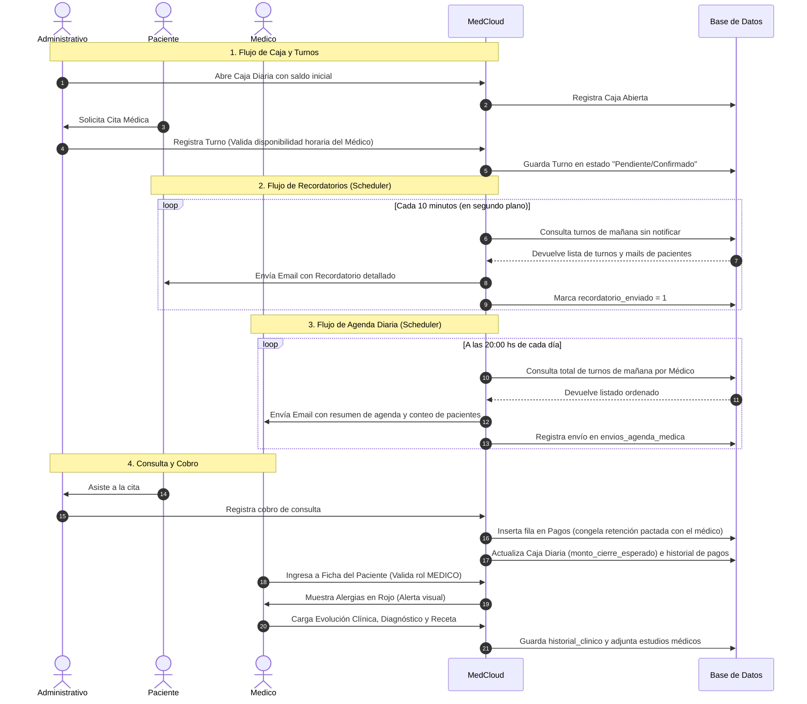

# Documento de Especificación Funcional: MedCloud
**Rol**: Analista de Sistemas Senior  
**Destinatarios**: Clientes, Gerencia de Clínicas y Centros de Salud  
**Fecha de Emisión**: 15 de Junio de 2026  

---

## 1. Introducción y Propósito del Sistema

**MedCloud** es una solución integral de software médico y financiero de vanguardia, diseñada para optimizar los flujos operativos en clínicas y consultorios privados. El sistema está estructurado bajo un enfoque multiusuario con segregación de funciones, garantizando un control estricto sobre la agenda de citas, la confidencialidad de las historias clínicas de los pacientes, el flujo de dinero en efectivo en el centro de salud y la distribución automática de honorarios médicos.

Este documento detalla el comportamiento funcional del sistema de una manera accesible para perfiles directivos y clientes interesados en contratar el servicio, explicando los procesos clave, los flujos de información, las reglas de negocio y las excepciones de control.

---

## 2. Razones Clave para Contratar MedCloud (Valor Comercial)

Para una administración médica y financiera sin fisuras, MedCloud ofrece cinco pilares indispensables que justifican y aceleran su adopción:

1. **Control de Caja Diaria en Tiempo Real**: Evita discrepancias de dinero mediante un proceso rígido de apertura y cierre de caja. El sistema calcula dinámicamente el dinero esperado y obliga al personal administrativo a rendir cuentas ante cualquier desvío físico.
2. **Distribución Automática de Honorarios (Liquidaciones)**: Automatiza el cobro médico basándose en acuerdos porcentuales de retención por profesional. Al momento del pago, el sistema congela la tasa acordada, garantizando liquidaciones transparentes y estables ante futuros cambios contractuales.
3. **Recordatorios Automatizados de Turnos**: Reduce el absentismo de pacientes mediante notificaciones automáticas previas a la cita y mantiene informados a los profesionales enviándoles de manera proactiva su agenda de pacientes para el día siguiente.
4. **Ficha Médica con Alertas Críticas**: Permite a los médicos visualizar alergias y condiciones críticas resaltadas de forma destacada en color rojo en la ficha del paciente para prevenir negligencias médicas graves.
5. **Estricta Seguridad y Confidencialidad**: Estructura de accesos blindada mediante roles de usuario ([Roles](file:///c:/Users/nmigl/MedCloud/database/DER.md#L13-L17)). El personal administrativo gestiona la agenda y la cobranza sin tener acceso a los diagnósticos o evolución clínica del paciente, mientras que los médicos disponen de un entorno privado de diagnóstico y prescripción.

---

## 3. Modelo de Licencia y Periodo de Prueba (Trial)

MedCloud ofrece una modalidad de demostración funcional inicial (**Trial de 15 días**) para que los centros médicos evalúen el producto de forma directa y práctica. El ciclo de vida de la licencia se rige por las siguientes reglas de control:

### 3.1. Funcionamiento del Trial
* Al dar de alta el entorno por primera vez, el sistema se inicializa en modo Trial (configurado en la tabla [configuracion_trial](file:///c:/Users/nmigl/MedCloud/database/DER.md#L39-L45) con `es_trial = 1`).
* Cada vez que un usuario inicia sesión, el sistema calcula la diferencia entre la fecha de inicio del Trial más la cantidad de días permitidos (15 días) respecto al día actual, obteniendo la propiedad computada `trial_dias_restantes` (definida en el SP [sp_LoginUsuario](file:///c:/Users/nmigl/MedCloud/database/migrations/011_create_configuracion_trial.sql#L67-L93)).

### 3.2. Mecanismo de Bloqueo por Expiración
Para proteger los datos de alteraciones sin licencia pero permitiendo que el cliente consulte su información histórica, el sistema implementa un bloqueo de seguridad en dos niveles:
1. **Bloqueo en el Servidor (Backend)**: El componente de seguridad ([auth.middleware.js](file:///c:/Users/nmigl/MedCloud/MedCloud-Backend/src/middlewares/auth.middleware.js#L27-L38)) intercepta todas las solicitudes del sistema. Si los días restantes de prueba son inferiores a `0` (vencido), bloquea de inmediato cualquier acción de escritura (**crear, editar o eliminar** enviando error `403 TRIAL_EXPIRED`), permitiendo únicamente consultas de lectura.
2. **Bloqueo de Interfaz de Usuario (Frontend)**: Si el trial ha expirado, el sistema oculta los controles normales y despliega un panel de bloqueo absoluto (pantalla de bloqueo definida en [App.jsx](file:///c:/Users/nmigl/MedCloud/frontend/src/App.jsx#L222-L339)). Este panel le impide al operador navegar por las pestañas normales del consultorio y ofrece un botón de contacto directo para la activación.

### 3.3. Proceso de Alta y Activación de la Licencia
Cuando el cliente decide adquirir la versión completa del sistema, el flujo de activación es simple y transparente:
1. El cliente hace clic en el botón **"Activar Licencia"** que figura en los banners de aviso del sistema o en la pantalla de bloqueo.
2. Esto abre de forma directa un chat de soporte por WhatsApp con un mensaje preconfigurado (ej: *"Hola! Terminó mi periodo de prueba de MedCloud y quiero activar mi licencia"*).
3. Una vez verificado el pago de la licencia, el equipo de soporte técnico ejecuta una actualización rápida en la base de datos (actualizando `es_trial = 0` en la tabla `configuracion_trial`).
4. **Resultado**: El sistema se activa de inmediato para todos los usuarios del centro médico de forma transparente, eliminando los avisos del trial y desbloqueando permanentemente las funciones de registro de información.

---

## 4. Programador de Recordatorios y Agendas Automáticas (Scheduler)

MedCloud incluye un módulo inteligente de automatización ([scheduler.js](file:///c:/Users/nmigl/MedCloud/MedCloud-Backend/src/utils/scheduler.js)) que ejecuta tareas en segundo plano a intervalos fijos de tiempo (cada 10 minutos) para gestionar la comunicación de la clínica:

### 4.1. Recordatorio de Turnos a Pacientes
* **Objetivo**: Asegurar que los pacientes asistan a sus turnos de mañana.
* **Cuándo se ejecuta**: De forma continua cada 10 minutos en segundo plano.
* **Flujo Operativo**:
  1. El sistema realiza una consulta en la base de datos buscando todos los turnos del día de **mañana** que estén en estado *Pendiente* o *Confirmado* y que posean el control de recordatorio en `0` (`recordatorio_dia_anterior_enviado = 0`).
  2. Para cada turno encontrado, extrae la dirección de email registrada del paciente.
  3. Despacha un correo electrónico personalizado e institucional conteniendo: Nombre del Paciente, Fecha y Hora del Turno, Nombre del Médico y Especialidad.
  4. Una vez enviado el correo con éxito, actualiza el estado del turno asignándole `recordatorio_dia_anterior_enviado = 1` para prevenir el envío duplicado del mensaje en los siguientes ciclos del programador.
  5. *Caso especial*: Si el paciente no posee un correo electrónico válido, el sistema lo marca automáticamente como procesado para evitar bucles repetitivos de búsqueda.

### 4.2. Aviso a Médicos de su Agenda de Mañana
* **Objetivo**: Notificar a cada profesional de la salud cuántos pacientes atenderá mañana y enviarle su grilla de turnos en un formato cómodo.
* **Cuándo se ejecuta**: A las **20:00 hs (8:00 PM)** de todos los días.
* **Flujo Operativo**:
  1. El programador de tareas evalúa la hora del servidor. Si es la ventana horaria de las 20:00 hs, inicia el proceso de aviso.
  2. Consulta qué médicos tienen turnos programados para el día siguiente y verifica que no se les haya enviado ya la agenda de esa fecha (consultando contra la tabla de control `envios_agenda_medica`).
  3. Para cada médico calificado, el sistema recopila de forma ordenada todas sus citas del día de mañana (Paciente, Horario exacto de Inicio y Fin, Estado y Motivo de la Consulta).
  4. Genera una plantilla de correo electrónico HTML dinámica que incluye:
     * El recuento total de pacientes programados para mañana (ej: *"Mañana tendrás 12 pacientes asignados"*).
     * Una tabla detallada con los horarios y nombres de los pacientes.
  5. Envía la agenda por correo al email del profesional.
  6. Registra un renglón en la tabla `envios_agenda_medica` para ese médico y esa fecha. Esto asegura que el aviso se envíe **exactamente una vez** durante la franja de las 20:00 hs.

---

## 5. Descripción Detallada de Módulos y Flujos CRUD

A continuación se analizan los principales módulos del sistema, tomando al **Módulo de Pacientes** como ejemplo integral de ciclo CRUD (Crear, Leer, Actualizar, Borrar) y extendiendo el mismo análisis funcional a los demás módulos de la plataforma.

---

### MÓDULO 1: Gestión de Pacientes (Ejemplo CRUD Base)
Centraliza la base de datos demográfica e información clínica general de las personas atendidas en la clínica.

#### A. Flujo de Procesos (CRUD)
* **Alta (Crear - Create)**:
  * El administrativo completa el formulario de Paciente.
  * El sistema normaliza automáticamente el formato de teléfono celular agregando el prefijo internacional de celulares de Argentina (`549`) para posibilitar futuros envíos de recordatorios sin errores.
  * Se vincula al paciente con una Obra Social del listado y se introduce su Número de Afiliado.
  * Se registran campos de alerta médica como **Alergias**, Dirección y Teléfono de Contacto de Emergencia.
* **Búsqueda y Visualización (Leer - Read)**:
  * El personal puede filtrar y buscar pacientes escribiendo su número de **DNI** o por **Nombre / Apellido**.
  * Al ingresar a la ficha del paciente, la plataforma busca alertas especiales. Si existen datos en el campo "Alergias", la pantalla muestra un recuadro de aviso destacado en color **rojo** para evitar descuidos en prescripciones médicas.
* **Modificación (Actualizar - Update)**:
  * Permite corregir datos demográficos, cambios de obra social, nuevos contactos de emergencia o actualizar la lista de alergias.
* **Baja y Consistencia (Eliminar - Delete)**:
  * *Excepción Crítica*: Un paciente no puede ser borrado físicamente si posee turnos agendados o registros en su historia clínica, para resguardar la validez y consistencia legal de los datos. En lugar de un borrado permanente de base de datos, el sistema restringe o inactiva los registros relacionados manteniendo la coherencia histórica.

#### B. Excepciones y Reglas de Negocio
* **DNI Único**: No se permite registrar a dos pacientes con el mismo número de DNI.
* **Validación de Email**: El campo de correo electrónico debe seguir un patrón formal (ej: `nombre@dominio.com`) para evitar errores en el Scheduler de recordatorios.

---

### MÓDULO 2: Gestión de Profesionales y Horarios
Administra al equipo de salud del consultorio, sus comisiones y su grilla de atención semanal.

#### A. Flujo de Procesos (CRUD)
* **Alta (Crear)**:
  * Al dar de alta a un profesional, se ingresa su especialidad, su número de matrícula y sus condiciones comerciales (su **porcentaje de retención** para la clínica).
  * El sistema requiere ingresar los horarios semanales del médico mediante una grilla interactiva (ej: Lunes de 09:00 a 14:00, Miércoles de 10:00 a 18:00).
  * *Automatización*: Al confirmar el alta del médico, el procedimiento transaccional de base de datos ([sp_CreateProfesional](file:///c:/Users/nmigl/MedCloud/database/DER.md#L376-L378)) crea automáticamente una cuenta de usuario para el médico con perfil `MEDICO`, estableciendo una contraseña temporal por defecto (su número de documento/Cuit) y activando la bandera de **cambio de contraseña obligatorio** para su primer inicio de sesión.
* **Búsqueda y Visualización (Leer)**:
  * Listado de médicos activos y visualización de sus turnos disponibles en el calendario.
* **Modificación (Actualizar)**:
  * Permite actualizar datos demográficos, modificar el porcentaje de retención para nuevas consultas y rediseñar su grilla de horarios semanales.
* **Baja (Eliminar)**:
  * Un médico no se elimina físicamente si posee registros históricos de turnos o liquidaciones, manteniéndose su registro para auditoría histórica de pagos.

#### B. Excepciones y Reglas de Negocio
* **Horarios Consistentes**: No se pueden guardar horarios con hora de inicio mayor o igual a la hora de fin (ej: entrada a las 18:00 y salida a las 12:00).
* **Matrícula y CUIT únicos**: Previene duplicidades de profesionales en el centro de salud.

---

### MÓDULO 3: Agenda y Reservas de Turnos
Permite la coordinación física de las citas médicas cruzando la disponibilidad del médico con los requerimientos del paciente.

#### A. Flujo de Procesos (CRUD)
* **Creación de Citas (Crear)**:
  * Se selecciona el médico, la fecha y se eligen horarios del catálogo de rangos libres de su agenda semanal.
  * El sistema inicializa la cita en estado `'Pendiente'` o `'Confirmado'`.
* **Seguimiento del Calendario (Leer)**:
  * Panel visual de turnos tipo calendario. Permite filtros por médico para ver las horas ocupadas y libres.
* **Gestión de Estados (Actualizar)**:
  * Los turnos transicionan de estado durante el día: `'Pendiente'` -> `'Confirmado'` -> `'Completado'` (cuando el paciente asistió) o `'Cancelado'` (si el paciente o el médico anularon la cita).
* **Cancelación de Citas (Eliminar)**:
  * El administrativo cancela el turno, liberando inmediatamente el espacio en la grilla horaria para que pueda ser reservado por otro paciente.

#### B. Excepciones y Reglas de Negocio
* **Prevención de Superposiciones**: El sistema impide agendar dos turnos al mismo tiempo para el mismo médico, lanzando una advertencia de bloqueo.
* **Fuera de Rango**: No se pueden agendar turnos fuera de los días y horarios declarados de atención del profesional.

---

### MÓDULO 4: Control de Caja Diaria
Módulo contable esencial para auditoría física de ingresos diarios en el área administrativa de secretaría.

#### A. Flujo de Procesos (CRUD)
* **Apertura de Caja (Crear)**:
  * Al inicio del día laboral, el administrativo debe abrir la caja indicando el saldo físico de apertura (dinero disponible para dar vueltos, ej: $5.000). El estado de la caja pasa a `'Abierta'`.
* **Registro y Carga de Cobros (Leer / Actualizar)**:
  * Cada vez que un paciente asiste a un turno, el administrativo registra el pago en caja seleccionando el método de cobro (Efectivo, Transferencia, Tarjeta). El sistema suma automáticamente el monto a la propiedad `monto_cierre_esperado`.
* **Cierre de Caja (Actualizar)**:
  * Al finalizar el día, el operador realiza un conteo físico de los billetes y la caja e ingresa el total en `monto_cierre_real`.
  * El sistema computa automáticamente la **Diferencia de Caja** (`Cierre Real - Cierre Esperado`).
  * Guarda las firmas de auditoría (Usuario de Apertura, Usuario de Cierre y sus respectivas fechas y horas exactas) y cambia el estado de la caja a `'Cerrada'`.

#### B. Excepciones y Reglas de Negocio
* **Flujo Bloqueado**: El sistema prohíbe registrar cobros o pagos de turnos si no existe una caja del día abierta.
* **Caja Única por Día**: No se puede tener más de una caja abierta al mismo tiempo para la fecha en curso.
* **Caja Cerrada Inmutable**: Una vez que una caja diaria se declara como Cerrada, no admite mutaciones o inserción de nuevos pagos.

---

### MÓDULO 5: Liquidación de Honorarios Médicos
Permite realizar los cierres financieros para retribuir a los profesionales de la salud.

#### A. Flujo de Procesos (CRUD)
* **Procesamiento de Liquidación (Crear)**:
  * El administrador selecciona un rango de fechas y un médico en particular.
  * El sistema extrae todos los turnos completados y cobrados en ese periodo.
  * Aplica los porcentajes de retención congelados en cada pago (guardados en la tabla `pagos` en el campo `porcentaje_retencion` al momento de la facturación).
  * Computa el **monto bruto**, la **retención de la clínica** y el **neto que le corresponde cobrar al médico**.
* **Visualización de Reportes (Leer)**:
  * Muestra una planilla resumen interactiva con el detalle de las sumas a liquidar, facilitando la generación del pago físico o transferencia.

#### B. Excepciones y Reglas de Negocio
* **Congelamiento de Condiciones**: La retención copiada del perfil del profesional se guarda físicamente en la fila del pago. Si la clínica decide modificar la comisión de un médico de 20% a 25% el día de hoy, los turnos cobrados la semana pasada a tasa de 20% mantendrán sus comisiones intactas, evitando recálculos financieros retroactivos incorrectos.

---

### MÓDULO 6: Historia Clínica Digital
Fichero médico privado reservado exclusivamente para el personal de salud para asentar las consultas de los pacientes.

#### A. Flujo de Procesos (CRUD)
* **Alta de Evolución (Crear)**:
  * El médico abre la ficha clínica del paciente durante la consulta e ingresa: Motivo de consulta, Evolución (síntomas, examen físico, notas), Diagnóstico oficial y Tratamiento prescrito.
  * Puede adjuntar archivos médicos (estudios en PDF, imágenes radiológicas) a la ficha del paciente.
* **Consulta Histórica (Leer)**:
  * El médico puede visualizar la línea de tiempo de todas las evoluciones previas redactadas por él u otros profesionales de la clínica.
* **Modificación Restringida (Actualizar)**:
  * Permite editar o agregar notas complementarias en caso de correcciones clínicas inmediatas.
* **Seguridad de Acceso (Excepciones y Privacidad)**:
  * *Exclusión de Roles*: Los usuarios administrativos y de recepción no tienen acceso al módulo de Historia Clínica. Si intentan ingresar a una URL clínica, el sistema los redirige de inmediato bloqueando la consulta.
  * *Permisos Compartidos (Acceso Invitado)*: Por defecto, un médico visualiza las evoluciones generadas en el centro médico. No obstante, a nivel de base de datos se contempla la tabla [Permisos_Historial](file:///c:/Users/nmigl/MedCloud/database/DER.md#L141-L145), la cual permite autorizar a un profesional invitado a visualizar una ficha médica específica para interconsultas rápidas, garantizando confidencialidad.

---

## 6. Resumen de Flujos y Relación de Entidades

La siguiente representación resume visualmente cómo interactúan los actores y procesos clave de MedCloud:

---
*Este documento ha sido confeccionado con fines de análisis funcional y soporte comercial para la adquisición de la plataforma MedCloud.*

