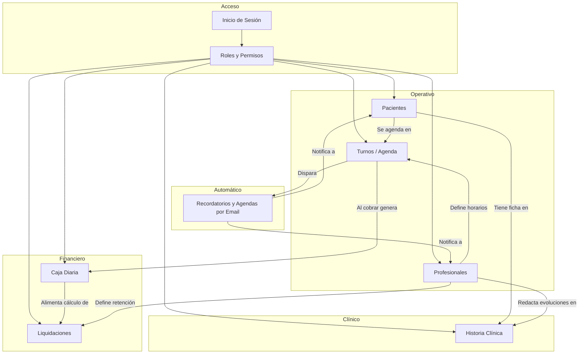

# Guía de Gestión por Módulos — MedCloud

**Destinatario:** Cliente / Gerencia / Personal operativo del centro médico  
**Versión:** 1.0  
**Fecha:** 19 de Junio de 2026  
**Basado en:** Código fuente del sistema (frontend, backend y base de datos)

---

## 1. ¿Qué es MedCloud?

MedCloud es un sistema web integral para clínicas y consultorios que centraliza la operación diaria en un solo lugar:

- Registro y seguimiento de **pacientes**
- Administración de **profesionales** y sus horarios de atención
- **Agenda de turnos** con calendario y recordatorios automáticos
- **Caja diaria** con control de ingresos y auditoría
- **Liquidación de honorarios** médicos con retenciones automáticas
- **Historia clínica digital** con acceso restringido solo a médicos

El sistema se organiza en **módulos independientes pero interconectados**. Cada módulo tiene su propio menú en la barra lateral y reglas de acceso según el rol del usuario.

---

## 2. Roles de usuario y permisos

MedCloud define tres perfiles principales. Cada uno ve distintas secciones del menú y puede realizar distintas acciones.

| Módulo / Acción | ADMIN | RECEPCIÓN | MÉDICO |
|-----------------|:-----:|:---------:|:------:|
| Panel principal (Dashboard) | ✅ | ✅ | ✅ |
| Ver listado de pacientes | ✅ | ✅ | ✅ |
| Crear / editar / eliminar pacientes | ✅ | ✅ | ❌ |
| Ver listado de profesionales | ✅ | ✅ | ❌ |
| Crear / editar profesionales y horarios | ✅ | ✅ | ❌ |
| Ver agenda de turnos | ✅ | ✅ | ✅ (solo los suyos) |
| Crear / editar / cancelar turnos | ✅ | ✅ | ❌ |
| Registrar cobros en caja | ✅ | ✅ | ❌ |
| Abrir / cerrar caja diaria | ✅ | ✅ | ❌ |
| Consultar liquidaciones de honorarios | ✅ | ✅ | ❌ |
| Gestionar usuarios y roles | ✅ | ✅ | ❌ |
| Acceder a historia clínica | ❌ | ❌ | ✅ |
| Cargar evoluciones clínicas | ❌ | ❌ | ✅ |

> **Nota de seguridad:** Si un usuario intenta ingresar a una sección sin permiso, el sistema muestra un mensaje de acceso restringido y lo redirige al panel principal.

---

## 3. Acceso al sistema

### 3.1. Inicio de sesión

1. El usuario ingresa su **nombre de usuario** y **contraseña** en la pantalla de login.
2. Si las credenciales son correctas, accede al **Panel principal**.
3. Si es su **primer ingreso** (contraseña temporal), el sistema obliga a cambiar la contraseña antes de continuar.

### 3.2. Recuperación de contraseña

- Desde el login, el usuario puede solicitar restablecer su contraseña por correo electrónico.
- El sistema envía un enlace temporal (válido por 1 hora) para definir una nueva contraseña.

### 3.3. Periodo de prueba (Trial)

MedCloud incluye un periodo de demostración de **15 días**:

| Situación | Comportamiento |
|-----------|----------------|
| Trial activo | El sistema funciona con normalidad. Se muestra un aviso con los días restantes. |
| Trial vencido | Se bloquean las acciones de **crear, editar y eliminar**. Solo se permite **consultar** información existente. |
| Activación de licencia | El cliente contacta a soporte; una vez activada, el bloqueo se elimina para todos los usuarios. |

---

## 4. Panel principal (Dashboard)

**Menú:** Inicio (pantalla principal al ingresar)

Es la vista de resumen del centro médico. Muestra en tiempo real:

| Indicador | Descripción | Acceso directo |
|-----------|-------------|----------------|
| Total de pacientes | Cantidad de pacientes registrados | → Módulo Pacientes |
| Total de profesionales | Médicos activos en el sistema | → Módulo Profesionales |
| Total de usuarios | Operadores con acceso al sistema | → Módulo Usuarios |
| Citas del día | Turnos programados para hoy (excluye cancelados) | → Módulo Turnos |
| Caja diaria | Estado (Abierta/Cerrada) y monto en efectivo acumulado | → Módulo Caja |
| Liquidación médica | Acceso rápido al cálculo de honorarios | → Módulo Liquidaciones |

Además, el panel lista las **5 próximas citas** con paciente, profesional, fecha, hora y estado.

### Buscador global

En la barra superior hay un buscador de pacientes por **DNI, nombre o apellido**. Al seleccionar un resultado, el sistema navega directamente a la ficha del paciente.

---

## 5. Módulo: Pacientes

**Menú lateral:** Pacientes → Listado / Nuevo Paciente  
**Quién lo gestiona:** Administración y Recepción (alta y edición). Los médicos solo pueden consultar el listado.

### 5.1. ¿Para qué sirve?

Centraliza los datos demográficos y de contacto de cada persona atendida en el centro, incluyendo información clínica de alerta.

### 5.2. Datos que se registran

| Campo | Descripción |
|-------|-------------|
| DNI | Documento único. No se permiten duplicados. |
| Nombre y apellido | Identificación del paciente. |
| Fecha de nacimiento | Para cálculo de edad. |
| Teléfono | Se normaliza automáticamente al formato argentino (`549...`) para recordatorios. |
| Email | Requerido para envío de recordatorios de turno. |
| Obra social y número de afiliado | Cobertura médica del paciente. |
| Sexo y grupo sanguíneo | Datos clínicos generales. |
| Dirección | Domicilio del paciente. |
| Contacto de emergencia | Persona y teléfono de urgencia. |
| **Alergias** | Campo crítico: si tiene contenido, se muestra en **rojo** al abrir la ficha. |

### 5.3. Operaciones habituales

| Operación | Cómo se realiza |
|-----------|-----------------|
| **Alta de paciente** | Menú → Pacientes → Nuevo Paciente → Completar formulario → Guardar. |
| **Buscar paciente** | Usar el buscador del listado o el buscador global de la barra superior. |
| **Editar datos** | Desde el listado, seleccionar el paciente y modificar los campos necesarios. |
| **Eliminar paciente** | Solo si no tiene turnos ni registros en historia clínica. De lo contrario, el sistema impide la eliminación. |

### 5.4. Reglas importantes

- El DNI debe ser único en todo el sistema.
- El email debe tener formato válido (`nombre@dominio.com`) para que funcionen los recordatorios automáticos.
- Los médicos **no pueden** crear, editar ni eliminar pacientes; solo visualizar el listado y acceder a la historia clínica.

---

## 6. Módulo: Profesionales

**Menú lateral:** Profesionales → Listado / Nuevo Profesional  
**Quién lo gestiona:** Administración y Recepción.

### 6.1. ¿Para qué sirve?

Administra el equipo médico del centro: datos personales, especialidad, condiciones comerciales y **grilla de horarios semanal** de atención.

### 6.2. Datos que se registran

| Campo | Descripción |
|-------|-------------|
| Nombre, apellido, DNI/CUIT | Identificación del profesional. |
| Matrícula (MN o MP) | Número de matrícula nacional o provincial. |
| Especialidad | Área médica de atención. |
| Email y teléfono | Contacto y envío de agenda diaria. |
| Duración promedio de turno | Tiempo en minutos por consulta (ej: 30 min). |
| Porcentaje de honorario | Porcentaje que cobra el médico (la clínica retiene el resto). |
| Fecha de nacimiento y sexo | Datos demográficos. |
| **Horarios semanales** | Grilla interactiva: días y rangos horarios de atención. |

### 6.3. Operaciones habituales

| Operación | Cómo se realiza |
|-----------|-----------------|
| **Alta de profesional** | Menú → Profesionales → Nuevo → Completar datos + activar días de atención en la grilla → Guardar. |
| **Editar profesional** | Desde el listado, modificar datos o rediseñar la grilla horaria. |
| **Consultar listado** | Ver todos los profesionales activos con sus especialidades. |

### 6.4. Automatización al dar de alta un médico

Al crear un profesional, el sistema automáticamente:

1. Genera una **cuenta de usuario** con rol MÉDICO.
2. Asigna un nombre de usuario derivado del nombre (ej: `mlopez`).
3. Establece una **contraseña temporal** (basada en su documento).
4. Obliga al médico a **cambiar la contraseña** en su primer ingreso.

### 6.5. Reglas importantes

- No se pueden guardar horarios donde la hora de inicio sea mayor o igual a la hora de fin.
- La matrícula y el CUIT deben ser únicos.
- Un profesional con turnos o liquidaciones históricas no se elimina; se conserva para auditoría.

---

## 7. Módulo: Turnos (Agenda)

**Menú lateral:** Turnos → Agenda / Nuevo Turno  
**Quién lo gestiona:** Administración y Recepción (creación y cobros). Los médicos consultan su agenda.

### 7.1. ¿Para qué sirve?

Coordina las citas médicas cruzando la disponibilidad del profesional con las necesidades del paciente.

### 7.2. Vistas disponibles

| Vista | Descripción |
|-------|-------------|
| **Listado** | Tabla con todos los turnos, filtros, ordenamiento y paginación. |
| **Calendario** | Vista mensual/semanal/diaria tipo agenda visual. |

### 7.3. Estados de un turno

```
Pendiente → Confirmado → Completado
                ↓
            Cancelado
```

| Estado | Significado |
|--------|-------------|
| **Pendiente** | Turno reservado, aún no confirmado. |
| **Confirmado** | El paciente confirmó su asistencia. |
| **Completado** | El paciente asistió y se registró el cobro. |
| **Cancelado** | La cita fue anulada; el horario queda libre. |

### 7.4. Operaciones habituales

| Operación | Cómo se realiza |
|-----------|-----------------|
| **Agendar turno** | Turnos → Nuevo Turno → Seleccionar médico, paciente, fecha/hora y motivo → Guardar. |
| **Confirmar turno** | Desde la agenda, cambiar estado a Confirmado o enviar email de confirmación. |
| **Registrar cobro** | Cuando el paciente asiste, registrar monto y método de pago (Efectivo, Transferencia, Tarjeta). El turno pasa a Completado. |
| **Cancelar turno** | Cambiar estado a Cancelado; el horario queda disponible para otro paciente. |

### 7.5. Reglas importantes

- No se pueden agendar dos turnos al mismo horario para el mismo médico.
- No se pueden agendar turnos fuera de los días y horarios definidos en la grilla del profesional.
- Para registrar un cobro, debe existir una **caja diaria abierta**.
- Los médicos ven únicamente **sus propios turnos** en la agenda.

---

## 8. Módulo: Caja Diaria

**Menú lateral:** Caja Diaria → Control de Caja / Historial de Cierres  
**Quién lo gestiona:** Administración y Recepción.

### 8.1. ¿Para qué sirve?

Controla el flujo de dinero en efectivo del centro, garantizando que cada peso cobrado quede registrado y auditado al cierre del día.

### 8.2. Ciclo diario de la caja

```
┌─────────────┐     ┌──────────────────┐     ┌─────────────┐
│  1. APERTURA │ ──→ │  2. COBROS DEL   │ ──→ │  3. CIERRE  │
│  (mañana)    │     │     DÍA          │     │  (fin día)  │
└─────────────┘     └──────────────────┘     └─────────────┘
```

#### Paso 1 — Apertura de caja (inicio del día)

1. Ir a **Caja Diaria → Control de Caja**.
2. Ingresar el **monto de apertura** (dinero inicial en el cajón para dar vueltos).
3. Confirmar. El estado pasa a **Abierta**.

#### Paso 2 — Cobros durante el día

- Cada vez que un paciente paga su consulta (desde el módulo Turnos), el sistema:
  - Registra el pago con monto, método y usuario que cobró.
  - Calcula automáticamente la retención de la clínica y el honorario del médico.
  - Suma el monto al **cierre esperado** de la caja.

#### Paso 3 — Cierre de caja (fin del día)

1. Contar físicamente el dinero en el cajón.
2. Ingresar el **monto real contado**.
3. El sistema calcula la **diferencia** (Real − Esperado) y registra:
   - Usuario y hora de apertura
   - Usuario y hora de cierre
   - Monto esperado vs. monto real
4. La caja pasa a estado **Cerrada** y no admite más cobros.

### 8.3. Historial de cierres

En **Caja Diaria → Historial de Cierres** se consultan todas las cajas cerradas con su balance, diferencias y responsables.

### 8.4. Reglas importantes

| Regla | Detalle |
|-------|---------|
| Caja obligatoria | No se pueden registrar cobros sin una caja abierta. |
| Una caja por día | Solo puede haber una caja abierta a la vez. |
| Caja cerrada es inmutable | Una vez cerrada, no se pueden agregar ni modificar pagos. |

---

## 9. Módulo: Liquidaciones

**Menú lateral:** Liquidaciones → Liquidar Médicos  
**Quién lo gestiona:** Administración y Recepción.

### 9.1. ¿Para qué sirve?

Calcula cuánto le corresponde cobrar a cada médico en un período determinado, descontando automáticamente la retención de la clínica.

### 9.2. Cómo se utiliza

1. Seleccionar el **profesional**.
2. Definir el **rango de fechas** (por defecto: mes en curso).
3. Presionar **Buscar**.
4. El sistema muestra:
   - **Detalle:** cada turno cobrado con monto bruto, retención y neto del médico.
   - **Consolidado:** totales del período (bruto, retención clínica, neto médico).
5. Opcionalmente, imprimir el reporte o registrar la liquidación.

### 9.3. Regla clave: congelamiento de retenciones

Cuando se cobra un turno, el sistema **guarda el porcentaje de retención vigente en ese momento**. Si después se modifica la comisión del médico, los cobros anteriores mantienen su tasa original. Esto garantiza liquidaciones justas y auditables.

**Ejemplo:**

| Situación | Retención aplicada |
|-----------|-------------------|
| Turno cobrado la semana pasada (retención 20%) | Se liquida con 20% |
| Turno cobrado hoy (retención cambiada a 25%) | Se liquida con 25% |

---

## 10. Módulo: Historia Clínica

**Acceso:** Desde el listado de pacientes → botón "Historia Clínica" (solo visible para médicos)  
**Quién lo gestiona:** Exclusivamente profesionales con rol MÉDICO.

### 10.1. ¿Para qué sirve?

Registro digital privado de las consultas médicas: evoluciones, diagnósticos, tratamientos y archivos adjuntos.

### 10.2. Datos de cada evolución

| Campo | Descripción |
|-------|-------------|
| Motivo | Razón de la consulta. |
| Evolución | Descripción clínica: síntomas, examen físico, notas. |
| Diagnóstico | Cuadro diagnosticado. |
| Tratamiento | Medicamentos, dosis e indicaciones. |
| Archivos adjuntos | Estudios en PDF, imágenes, etc. |

### 10.3. Operaciones habituales

| Operación | Cómo se realiza |
|-----------|-----------------|
| **Ver historial** | Pacientes → Seleccionar paciente → Historia Clínica. |
| **Cargar evolución** | Completar el formulario de nueva evolución → Guardar. |
| **Subir archivos** | Adjuntar estudios médicos a la ficha del paciente. |
| **Compartir con otro médico** | Autorizar acceso temporal a un colega para interconsulta. |

### 10.4. Seguridad y privacidad

- Los usuarios de **Administración y Recepción no tienen acceso** a este módulo.
- Al ingresar a la ficha del paciente, si existen **alergias** registradas, se muestran en un recuadro rojo de alerta.
- Los médicos ven las evoluciones de todos los profesionales del centro (con posibilidad de compartir acceso puntual a colegas invitados).

---

## 11. Módulo: Usuarios y Roles

**Menú lateral:** Usuarios / Roles  
**Quién lo gestiona:** Administración y Recepción.

### 11.1. Usuarios

Gestiona las cuentas de acceso al sistema (credenciales de login).

| Campo | Descripción |
|-------|-------------|
| Username | Nombre único para iniciar sesión. |
| Email | Correo del operador. |
| Rol | ADMIN, RECEPCIÓN o MÉDICO. |
| Estado | Activo / Inactivo. |

**Operaciones:** Alta, edición, desactivación y cambio de contraseña de usuarios.

### 11.2. Roles

Define los perfiles de acceso disponibles en el sistema.

| Rol (código) | Nombre | Acceso principal |
|--------------|--------|------------------|
| `ADMIN` | Administrador | Acceso completo a todos los módulos administrativos. |
| `RECEPCION` | Recepción | Gestión de pacientes, turnos, caja y liquidaciones. |
| `MEDICO` | Médico | Consulta de pacientes, agenda propia e historia clínica. |

> Los roles se crean y editan desde el módulo Roles. El **código** del rol (ej: `ADMIN`) es el que utiliza el sistema internamente para validar permisos.

---

## 12. Automatizaciones del sistema

MedCloud ejecuta tareas automáticas en segundo plano sin intervención del operador:

### 12.1. Recordatorio de turnos a pacientes

| Aspecto | Detalle |
|---------|---------|
| **Frecuencia** | Cada 10 minutos |
| **Qué hace** | Busca turnos de **mañana** en estado Pendiente o Confirmado que aún no fueron notificados. |
| **Acción** | Envía un email al paciente con fecha, hora, médico y especialidad. |
| **Control** | Marca el turno como notificado para no enviar duplicados. |
| **Requisito** | El paciente debe tener un email válido registrado. |

### 12.2. Agenda diaria para médicos

| Aspecto | Detalle |
|---------|---------|
| **Horario** | Todos los días a las **20:00 hs** |
| **Qué hace** | Recopila los turnos de **mañana** de cada médico. |
| **Acción** | Envía un email con el total de pacientes y una tabla detallada con horarios. |
| **Control** | Se envía una sola vez por médico por fecha. |

---

## 13. Flujo operativo diario recomendado

Este es el recorrido sugerido para el personal de recepción en un día típico:

```
MAÑANA                          DURANTE EL DÍA                    FIN DE DÍA
────────                        ───────────────                   ──────────

1. Abrir caja diaria            3. Atender pacientes:            6. Cerrar caja diaria
   (monto inicial)                  - Confirmar turnos              (contar efectivo,
                                   - Registrar cobros               registrar diferencia)
2. Revisar agenda del día       4. Agendar nuevos turnos
   en el Dashboard               5. Gestionar cancelaciones
```

### Detalle paso a paso

| Hora | Acción | Módulo |
|------|--------|--------|
| Inicio | Abrir caja con el efectivo inicial del cajón | Caja Diaria |
| Inicio | Revisar citas del día en el Dashboard | Panel principal |
| Continuo | Confirmar llegada de pacientes y registrar cobros | Turnos |
| Continuo | Agendar turnos nuevos según disponibilidad | Turnos |
| Continuo | Atender consultas de pacientes (buscar, editar datos) | Pacientes |
| Fin de día | Contar efectivo y cerrar caja | Caja Diaria |
| Semanal/Mensual | Calcular liquidaciones de honorarios | Liquidaciones |

---

## 14. Relación entre módulos

El siguiente diagrama muestra cómo se conectan los módulos entre sí:



---

## 15. Resumen de módulos

| # | Módulo | Función principal | Responsable |
|---|--------|-------------------|-------------|
| 1 | Panel principal | Vista de resumen y accesos rápidos | Todos |
| 2 | Pacientes | Registro demográfico y alertas médicas | Admin / Recepción |
| 3 | Profesionales | Equipo médico, horarios y comisiones | Admin / Recepción |
| 4 | Turnos | Agenda, confirmaciones y cobros | Admin / Recepción |
| 5 | Caja Diaria | Control de efectivo y auditoría | Admin / Recepción |
| 6 | Liquidaciones | Cálculo de honorarios médicos | Admin / Recepción |
| 7 | Historia Clínica | Evoluciones, diagnósticos y archivos | Médicos |
| 8 | Usuarios y Roles | Cuentas de acceso y permisos | Admin / Recepción |

---

*Documento elaborado a partir del análisis del código fuente de MedCloud (frontend React, backend Node.js y base de datos SQL Server). Para detalles técnicos de la arquitectura y reglas de negocio avanzadas, consultar el Documento de Análisis Funcional y la Especificación del Modelo Entidad-Relación (DER).*

