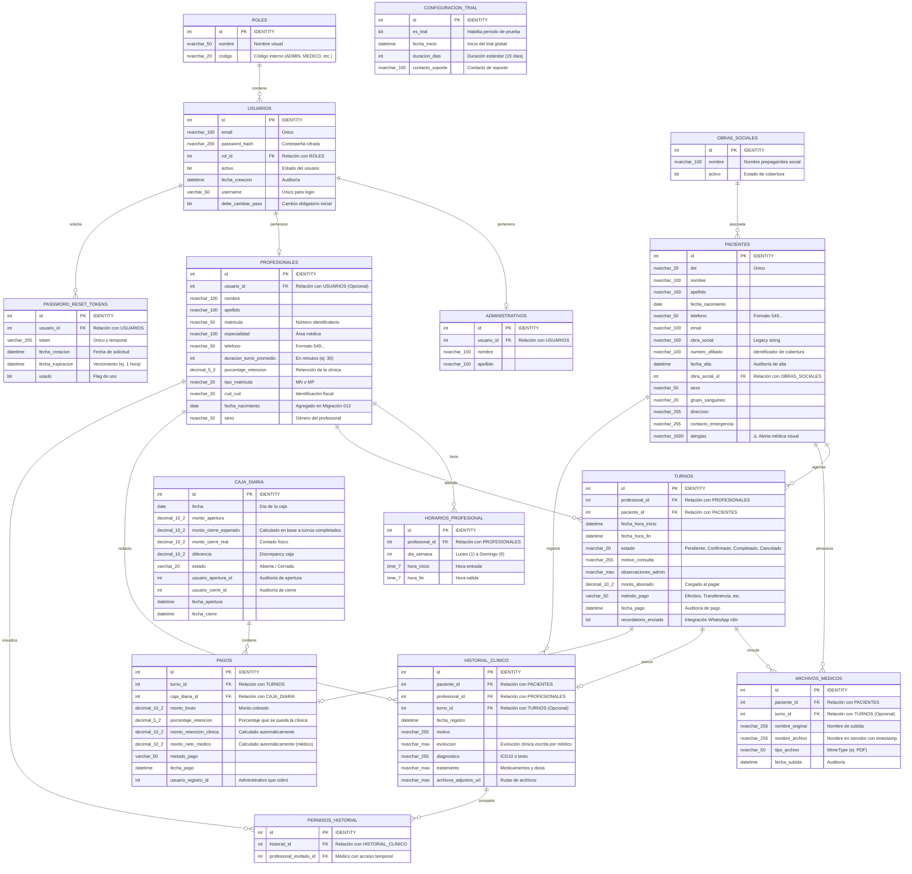

# Especificación del Modelo Entidad-Relación (DER) - MedCloud

Este documento describe detalladamente la estructura de la base de datos de **MedCloud** implementada en Microsoft SQL Server. Toda la lógica de mutación de datos se encuentra encapsulada en **Stored Procedures (Procedimientos Almacenados)** para garantizar la integridad referencial, consistencia de negocio, rendimiento y seguridad de las operaciones.

---

## 1. Diagrama Entidad-Relación (DER)

A continuación se presenta la representación gráfica de las tablas de la base de datos y sus relaciones utilizando la notación *Crow's Foot*:

---

## 2. Descripción de las Tablas y Atributos

### 2.1. Módulo de Seguridad y Sistema

#### Tabla: `roles`
Almacena los perfiles de acceso disponibles en el sistema (Administrativo, Médico, Superadmin).
*   `id` (INT, PK, IDENTITY): Clave primaria autoincremental.
*   `nombre` (NVARCHAR(50)): Nombre del rol en español (ej: "Médico", "Administrativo").
*   `codigo` (NVARCHAR(20)): Clave alfanumérica utilizada en el código frontend/backend para validar permisos (ej: `MEDICO`, `ADMIN`).

#### Tabla: `usuarios`
Entidad principal para el manejo de credenciales y sesiones de los operadores del sistema.
*   `id` (INT, PK, IDENTITY): Clave primaria.
*   `email` (NVARCHAR(100), UNIQUE): Dirección de correo principal.
*   `password_hash` (NVARCHAR(255)): Hash/Texto de la contraseña.
*   `rol_id` (INT, FK): Enlace a `roles.id`.
*   `activo` (BIT, Default 1): Indica si el usuario puede ingresar al sistema.
*   `fecha_creacion` (DATETIME, Default `GETDATE()`): Fecha de registro.
*   `username` (VARCHAR(50), UNIQUE): Nombre único utilizado en la pantalla de login.
*   `debe_cambiar_pass` (BIT, Default 1): Indica si el usuario debe resetear su contraseña obligatoriamente al primer acceso.

#### Tabla: `password_reset_tokens` *(Migración 010)*
Administra las solicitudes de restablecimiento de contraseña vía mail.
*   `id` (INT, PK, IDENTITY): Clave primaria.
*   `usuario_id` (INT, FK): Enlace a `usuarios.id`. Ante eliminación del usuario, se borra en cascada (`ON DELETE CASCADE`).
*   `token` (VARCHAR(255), UNIQUE): Cadena segura aleatoria que viaja en el enlace de recuperación.
*   `fecha_creacion` (DATETIME): Generación del token.
*   `fecha_expiracion` (DATETIME): Límite de uso del token (1 hora por defecto).
*   `usado` (BIT, Default 0): Cambia a 1 una vez utilizado para evitar ataques de repetición.

#### Tabla: `configuracion_trial` *(Migración 011)*
Controla el estado de demostración (periodo de prueba de 15 días) del software.
*   `id` (INT, PK, IDENTITY): Clave primaria.
*   `es_trial` (BIT, Default 1): Habilitador de la validación temporal.
*   `fecha_inicio` (DATETIME, Default `GETDATE()`): Instante en que inicia el trial global.
*   `duracion_dias` (INT, Default 15): Días otorgados de gracia.
*   `contacto_soporte` (NVARCHAR(100)): Email/Contacto mostrado en el bloqueo del frontend.

---

### 2.2. Módulo de Personal y Pacientes

#### Tabla: `administrativos`
Perfil de los usuarios de secretaría y administración.
*   `id` (INT, PK, IDENTITY): Clave primaria.
*   `usuario_id` (INT, FK): Referencia obligatoria a `usuarios.id` para el login de secretaría.
*   `nombre` (NVARCHAR(100)): Nombre de pila.
*   `apellido` (NVARCHAR(100)): Apellido familiar.

#### Tabla: `profesionales` *(Modificada en Migración 012)*
Médicos y profesionales de la salud habilitados en la clínica.
*   `id` (INT, PK, IDENTITY): Clave primaria.
*   `usuario_id` (INT, FK, NULL): Referencia a `usuarios.id` (los profesionales de prueba o inactivos pueden carecer de usuario asignado).
*   `nombre` (NVARCHAR(100)), `apellido` (NVARCHAR(100)): Nombre completo del profesional.
*   `matricula` (NVARCHAR(50)): Matrícula del médico para recetas y derivaciones.
*   `especialidad` (NVARCHAR(100)): Rama de especialización médica (ej: Pediatría, Cardiología).
*   `telefono` (NVARCHAR(50)): Almacena el número en formato internacional normalizado (`549XXXXXXXXXX`) para envío automatizado de recordatorios.
*   `duracion_turno_promedio` (INT, Default 30): Tiempo en minutos reservado para cada cita por defecto.
*   `porcentaje_retencion` (DECIMAL(5,2)): Porcentaje que retiene la clínica (ej: si el médico cobra el 80%, la retención es 20.00).
*   `tipo_matricula` (NVARCHAR(20)): Determina si es Nacional (`MN`) o Provincial (`MP`).
*   `cuit_cuil` (NVARCHAR(20)): CUIT/CUIL del profesional para liquidaciones.
*   `fecha_nacimiento` (DATE, NULL): Fecha de nacimiento del médico (agregada en migración 012).
*   `sexo` (NVARCHAR(50), NULL): Género declarado del médico (agregado en migración 012).

#### Tabla: `horarios_profesional`
Esquema de atención del profesional estructurado día por día.
*   `id` (INT, PK, IDENTITY): Clave primaria.
*   `profesional_id` (INT, FK): Enlace a `profesionales.id`.
*   `dia_semana` (INT): Valor del día. Lunes (1), Martes (2), Miércoles (3), Jueves (4), Viernes (5), Sábado (6), Domingo (0).
*   `hora_inicio` (TIME(7)), `hora_fin` (TIME(7)): Rango de atención diaria (ej. de 09:00:00 a 18:00:00).

#### Tabla: `obras_sociales`
Catálogo de entidades de medicina prepaga o coberturas aceptadas.
*   `id` (INT, PK, IDENTITY): Clave primaria.
*   `nombre` (NVARCHAR(100)): Denominación (ej: OSDE, Swiss Medical).
*   `activo` (BIT): Flag de cobertura activa.

#### Tabla: `pacientes`
Base de datos clínica de pacientes.
*   `id` (INT, PK, IDENTITY): Clave primaria.
*   `dni` (NVARCHAR(20)): Documento Nacional de Identidad del paciente (clave de búsqueda rápida).
*   `nombre` (NVARCHAR(100)), `apellido` (NVARCHAR(100)): Nombre completo del paciente.
*   `fecha_nacimiento` (DATE): Fecha utilizada para calcular la edad exacta en el UI.
*   `telefono` (NVARCHAR(50)): Formateado en el backend como `549XXXXXXXXXX`.
*   `email` (NVARCHAR(100)): Correo del paciente.
*   `obra_social` (NVARCHAR(100), NULL): Campo legado (string plano descriptivo).
*   `numero_afiliado` (NVARCHAR(100)): Credencial del paciente.
*   `fecha_alta` (DATETIME): Registro inicial en el centro médico.
*   `obra_social_id` (INT, FK): Relación normalizada a `obras_sociales.id`.
*   `sexo` (NVARCHAR(50)): Sexo/Género (utilizado en la historia clínica).
*   `grupo_sanguineo` (NVARCHAR(20)): Factor y grupo sanguíneo (ej: A+).
*   `direccion` (NVARCHAR(255)): Residencia.
*   `contacto_emergencia` (NVARCHAR(255)): Nombre y número de urgencia.
*   `alergias` (NVARCHAR(1000)): Alerta crítica de alergias (se resalta visualmente en rojo al entrar en la ficha del paciente).

---

### 2.3. Módulo Clínico y Turnos

#### Tabla: `turnos`
Agenda de citas médicas del consultorio.
*   `id` (INT, PK, IDENTITY): Clave primaria.
*   `profesional_id` (INT, FK): Enlace a `profesionales.id`.
*   `paciente_id` (INT, FK): Enlace a `pacientes.id`.
*   `fecha_hora_inicio` (DATETIME), `fecha_hora_fin` (DATETIME): Bloques de tiempo de la consulta.
*   `estado` (NVARCHAR(20)): Restringido mediante Constraint `CK_Turnos_Estado` a los valores: `'Pendiente'`, `'Confirmado'`, `'Completado'` o `'Cancelado'`.
*   `motivo_consulta` (NVARCHAR(255)): Descripción de la molestia/motivo.
*   `observaciones_admin` (NVARCHAR(MAX)): Notas añadidas por secretaría.
*   `monto_abonado` (DECIMAL(10,2)): Valor cancelado en caja (se sincroniza con la tabla pagos).
*   `metodo_pago` (VARCHAR(50)), `fecha_pago` (DATETIME): Detalles financieros del turno.
*   `recordatorio_enviado` (BIT): Flag para el bot n8n que previene duplicar alertas.

#### Tabla: `archivos_medicos`
Estudios clínicos, imágenes o documentos PDF adjuntados a la historia clínica del paciente.
*   `id` (INT, PK, IDENTITY): Clave primaria.
*   `paciente_id` (INT, FK): Relaciona el archivo a la ficha de un paciente específico.
*   `turno_id` (INT, FK, NULL): Si el estudio fue subido/vinculado a un turno en particular.
*   `nombre_original` (NVARCHAR(255)): Nombre original del archivo (ej: "AnalisisSangre.pdf").
*   `nombre_archivo` (NVARCHAR(255)): Nombre físico sanitizado y renombrado con timestamp único en el backend (ej: "1772770370490-800913851.pdf").
*   `tipo_archivo` (NVARCHAR(50)): Formato mime-type (ej: "application/pdf").
*   `fecha_subida` (DATETIME): Instante del upload.

#### Tabla: `historial_clinico`
Historia clínica digital y evoluciones de consultas.
*   `id` (INT, PK, IDENTITY): Clave primaria.
*   `paciente_id` (INT, FK), `profesional_id` (INT, FK): Identifica al paciente y al médico autor de la evolución.
*   `turno_id` (INT, FK, NULL): Turno asociado a la consulta.
*   `fecha_registro` (DATETIME): Fecha en que se redactó la evolución.
*   `motivo` (NVARCHAR(255)): Causa principal de la consulta.
*   `evolucion` (NVARCHAR(MAX)): Texto médico con los síntomas y hallazgos.
*   `diagnostico` (NVARCHAR(255)): Cuadro diagnosticado.
*   `tratamiento` (NVARCHAR(MAX)): Receta y sugerencias médicas.
*   `archivos_adjuntos_url` (NVARCHAR(MAX)): Rutas complementarias de documentos.

#### Tabla: `Permisos_Historial`
Acceso temporal a la historia clínica de un paciente para profesionales que no son el médico de cabecera.
*   `id` (INT, PK, IDENTITY): Clave primaria.
*   `historial_id` (INT, FK): Enlace a `historial_clinico.id`. Se borra en cascada si el historial es removido (`ON DELETE CASCADE`).
*   `profesional_invitado_id` (INT, FK): Profesional autorizado a visualizar el historial específico.

---

### 2.4. Módulo Financiero (Caja y Honorarios)

#### Tabla: `caja_diaria`
Registro de flujo de caja diaria administrativa de la clínica.
*   `id` (INT, PK, IDENTITY): Clave primaria.
*   `fecha` (DATE): Día operativo de la caja.
*   `monto_apertura` (DECIMAL(10,2)): Dinero inicial disponible.
*   `monto_cierre_esperado` (DECIMAL(10,2)): Calculado automáticamente sumando apertura y los cobros ingresados durante el día.
*   `monto_cierre_real` (DECIMAL(10,2)): Dinero físico real reportado por el cajero.
*   `diferencia` (DECIMAL(10,2)): Brecha entre esperado y real (`monto_cierre_real - monto_cierre_esperado`).
*   `estado` (VARCHAR(20)): Restringido a `'Abierta'` o `'Cerrada'`.
*   `usuario_apertura_id` (INT), `usuario_cierre_id` (INT): Auditoría de operadores de caja.
*   `fecha_apertura` (DATETIME), `fecha_cierre` (DATETIME): Tiempos de operación.

#### Tabla: `pagos`
Liquidación de consultas y distribución de honorarios médicos de forma automática.
*   `id` (INT, PK, IDENTITY): Clave primaria.
*   `turno_id` (INT, FK): Turno que origina la transacción financiera.
*   `caja_diaria_id` (INT, FK): Caja de cobro activa donde ingresó el dinero.
*   `monto_bruto` (DECIMAL(10,2)): Total pagado por el paciente.
*   `porcentaje_retencion` (DECIMAL(5,2)): Porcentaje retenido por el consultorio (copiado desde `profesionales` al momento de facturar para congelar las condiciones comerciales históricas).
*   `monto_retencion_clinica` (Column Computada): `CONVERT(DECIMAL(10,2), monto_bruto * (porcentaje_retencion / 100.0))`. Dinero que le corresponde a la clínica.
*   `monto_neto_medico` (Column Computada): `CONVERT(DECIMAL(10,2), monto_bruto * (1.0 - porcentaje_retencion / 100.0))`. Dinero asignado al honorario del profesional de la salud.
*   `metodo_pago` (VARCHAR(50)): Medio de pago (Efectivo, Tarjeta, Débito, Transferencia).
*   `fecha_pago` (DATETIME): Momento de registro.
*   `usuario_registro_id` (INT): Operador administrativo de caja que cobró el turno.

---

## 3. Procedimientos Almacenados (Stored Procedures) Destacados

La lógica de negocio reside prioritariamente en la base de datos SQL Server. Los procedimientos almacenados más relevantes incluyen:

1.  `sp_LoginUsuario`:
    *   **Propósito**: Valida las credenciales de ingreso.
    *   **Detalle**: Realiza un `INNER JOIN` entre `Usuarios` y `Roles`, cruzando mediante un `CROSS JOIN` con la tabla `configuracion_trial` para inyectar dinámicamente en la respuesta del JWT la columna computada `trial_dias_restantes`.
2.  `sp_VerificarTrial` *(Migración 011)*:
    *   **Propósito**: Bloquea transacciones cuando el periodo de prueba finaliza.
    *   **Detalle**: Si `es_trial = 1` y la diferencia entre la fecha de inicio más la duración permitida respecto del día de hoy es negativa, ejecuta un `;THROW` deteniendo inmediatamente cualquier operación de base de datos.
3.  `sp_CreateProfesional` *(Migración 012)*:
    *   **Propósito**: Alta transaccional de médicos en la clínica.
    *   **Detalle**: Genera de manera secuencial y única un `username` para el médico (ej: `mlopez`), le asigna su contraseña inicial en base a su DNI, crea el registro en `usuarios`, crea la fila en `profesionales` (guardando fecha de nacimiento, sexo, cuit, etc.) y parsea un string en formato JSON con la grilla de horarios del médico usando `OPENJSON` para insertarlos en `horarios_profesional`, todo bajo una misma **Transacción SQL** (`BEGIN TRANSACTION`).
4.  `sp_SetProfesional` *(Migración 012)*:
    *   **Propósito**: Edición de médicos.
    *   **Detalle**: Actualiza los datos demográficos y la configuración de honorarios/retenciones del profesional de la salud en la tabla `profesionales`.
5.  `sp_CreatePaciente` / `sp_SetPaciente`:
    *   **Propósito**: Alta y actualización de pacientes.
    *   **Detalle**: Vincula al paciente con su obra social id y almacena los campos clínicos avanzados (grupo sanguíneo, alergias y contacto de emergencia).

---

## 4. Flujos Clave Integrados

### 4.1. Normalización de Teléfonos Celulares (WhatsApp / n8n)
Tanto los pacientes como los médicos tienen normalizados sus números telefónicos en la base de datos con el formato de prefijo internacional de celulares de Argentina: `549` seguido del prefijo local de 10 dígitos (ej. `5491156789012`). Esto garantiza que los servicios automáticos de mensajería (n8n, APIs de WhatsApp) puedan disparar recordatorios de turnos sin errores de formato.

### 4.2. Control de Acceso y Periodo de Prueba (Trial)
Para evitar modificaciones maliciosas o el uso del sistema con una demostración expirada:
*   El backend intercepta las peticiones de escritura (`POST`, `PUT`, `DELETE`) en el middleware `verificarToken`.
*   Si `trial_dias_restantes` es menor a `0`, bloquea la petición antes de enviarla a la base de datos retornando un error HTTP `403` con código `TRIAL_EXPIRED`.
*   Adicionalmente, los procedimientos almacenados de base de datos pueden incorporar la llamada a `EXEC dbo.sp_VerificarTrial;` para brindar una capa redundante de protección contra escrituras directas.

